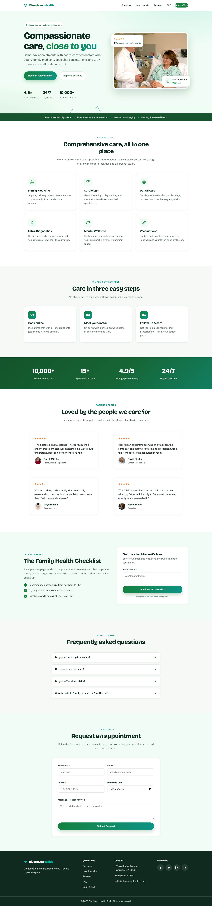

# BlueHaven Health

A single-page, responsive marketing website for a fictional healthcare clinic — built with **plain HTML, CSS, and vanilla JavaScript**. No frameworks, no build step, no dependencies.

🌐 **Live demo:** [alfredang.github.io/healthcare](https://alfredang.github.io/healthcare/)



> The screenshot above is captured automatically with Playwright. See [Screenshots](#screenshots) below.

---

## Features

- **Sticky navbar** with smooth-scroll anchor navigation and a mobile hamburger menu.
- **Two-column hero** with high-contrast copy, floating social-proof cards, a live "accepting patients" pulse, and an animated **ECG pulse-line** signature motif.
- **Services grid** — responsive cards led by clean inline **SVG icons** (no emoji).
- **"How it works"** three-step sequence, a **stats band**, and **testimonials** with avatars and star ratings.
- **Lead-magnet capture** — a gated "Family Health Checklist" with email-only opt-in and inline validation.
- **FAQ accordion** built on native `<details>`, backed by `FAQPage` structured data.
- **Enquiry form** with client-side validation (name, email, phone), inline per-field error messages, and an accessible success confirmation.
- **SEO-ready** — descriptive title/meta, canonical + Open Graph/Twitter tags, and `MedicalClinic` + `FAQPage` JSON-LD schema.
- **Fade-in-on-scroll** animations via `IntersectionObserver`.
- **Fully responsive**, mobile-first layout with a calming green medical palette.
- **Accessible** — WCAG-minded: skip link, semantic HTML, labels on every input, `alt`/`aria-label` on media, keyboard-friendly nav, ≥44px touch targets, and a `prefers-reduced-motion` fallback.

## Tech stack

- **HTML5** — semantic markup + JSON-LD structured data
- **CSS3** — custom properties (design tokens), Flexbox/Grid, mobile-first media queries
- **Vanilla JavaScript** — no libraries; wrapped in an IIFE, loaded with `defer`
- **Type** — [Bricolage Grotesque](https://fonts.google.com/specimen/Bricolage+Grotesque) (display) + [Public Sans](https://fonts.google.com/specimen/Public+Sans) (body), via Google Fonts

## Project structure

```
healthcare/
├── index.html      # Semantic markup — navbar, hero, services, testimonials, form, footer
├── styles.css      # All styling; design system lives in :root CSS custom properties
├── script.js       # Behavior: mobile nav, form validation, fade-in, footer year
├── CLAUDE.md       # Guidance for AI coding assistants
├── .mcp.json       # Project-level MCP servers (Playwright, for screenshots)
├── docs/
│   └── screenshot.png   # Full-page screenshot used in this README
└── .github/
    └── workflows/
        └── deploy.yml   # GitHub Actions → GitHub Pages deployment
```

## Running locally

There is no build step or dev server — just open the file:

```powershell
# Windows (PowerShell)
Start-Process index.html
```

```bash
# macOS / Linux
open index.html      # macOS
xdg-open index.html  # Linux
```

> Images are loaded from remote [Unsplash](https://unsplash.com) URLs, so an internet connection is required for them to appear. After editing, hard-refresh (**Ctrl+F5**) to bypass the browser cache.

## Customizing

- **Colors & spacing** — edit the CSS custom properties in the `:root` block at the top of [`styles.css`](styles.css). The whole theme is driven from there.
- **Content** — edit the copy directly in [`index.html`](index.html).
- **Form submission** — the form is currently client-side only and logs the submission to the console. Wire a real backend at the clearly marked `// TODO: POST to a real API endpoint here` block in [`script.js`](script.js).

> **Note:** `script.js` couples to the HTML by element `id` (`enquiryForm`, `navToggle`, `navMenu`, `formStatus`, `year`, and the form fields). If you rename an `id` in the HTML, update `script.js` to match.

## Deployment

The site auto-deploys to **GitHub Pages** via GitHub Actions on every push to `main` — see [`.github/workflows/deploy.yml`](.github/workflows/deploy.yml). No manual steps required.

## Screenshots

The README screenshot ([`docs/screenshot.png`](docs/screenshot.png)) is generated with **[Playwright](https://playwright.dev)**, wired up as a project-level **MCP server** in [`.mcp.json`](.mcp.json):

```json
{
  "mcpServers": {
    "playwright": {
      "command": "npx",
      "args": ["-y", "@playwright/mcp@latest"]
    }
  }
}
```

When this repo is opened in an MCP-aware client (e.g. Claude Code), the Playwright MCP server becomes available for driving a browser — navigating to the page, revealing the `.fade-in` sections, and capturing a full-page screenshot straight into `docs/`.

## License

This is a demo/portfolio project for educational purposes. BlueHaven Health is fictional. Photos are courtesy of [Unsplash](https://unsplash.com).
